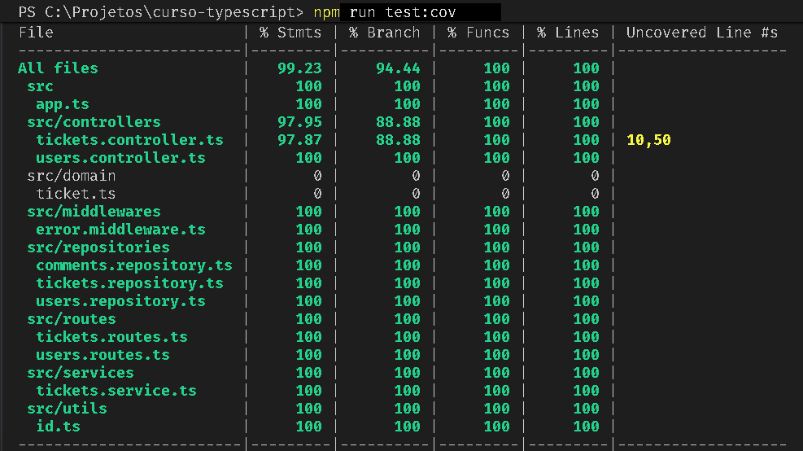

# Helpdesk API - TypeScript

API REST para gerenciamento de tickets de suporte tecnico, desenvolvida com Node.js, Express e TypeScript.
A aplicacao usa validacao de entrada com Zod e persistencia em memoria.

## Visao Geral

- Arquitetura em camadas (controllers, services, repositories, domain).
- Projeto 100% tipado com TypeScript.
- Validacao rigorosa de query/body com Zod.
- Testes automatizados de contrato HTTP com Vitest + Supertest.

## Stack

| Aspecto    | Tecnologia         |
| ---------- | ------------------ |
| Runtime    | Node.js 24.x       |
| Framework  | Express 5.x        |
| Linguagem  | TypeScript 6.x     |
| Validacao  | Zod                |
| Testes     | Vitest + Supertest |
| Dev Server | tsx watch          |
| Modulos    | ESM                |

## Estrutura

```text
src/
  app.ts
  controllers/
  services/
  repositories/
  routes/
  middlewares/
  domain/
  utils/
tests/
docs/
```

## Como rodar

### Usando os atalhos do projeto

Use os atalhos da raiz:

```bat
iniciar-dev.bat
```

ou:

```bat
abrir-cmd-node.bat
npm run dev
```

### Usando Node instalado na maquina

```bash
npm install
npm run dev
```

API local em:

```text
http://localhost:3000
```

### Build e producao

```bash
npm run build
npm start
```

### Rodando com Docker

Build da imagem:

```bash
docker build -t helpdesk-api .
```

Executando container:

```bash
docker run --rm -p 3000:3000 --name helpdesk-api helpdesk-api
```

Rodando com Docker Compose:

```bash
docker compose up --build -d
```

Parar os containers do compose:

```bash
docker compose down
```

### Testes

```bash
npm test
```

## Endpoints

### Tickets

| Metodo | Endpoint              | Descricao                             |
| ------ | --------------------- | ------------------------------------- |
| GET    | /tickets              | Lista tickets com filtros e paginacao |
| POST   | /tickets              | Cria ticket                           |
| GET    | /tickets/:id          | Obtem ticket com comentarios          |
| GET    | /tickets/:id/summary  | Obtem resumo do ticket                |
| PATCH  | /tickets/:id          | Atualiza ticket parcialmente          |
| POST   | /tickets/:id/comments | Adiciona comentario                   |

### Usuarios

| Metodo | Endpoint | Descricao      |
| ------ | -------- | -------------- |
| GET    | /users   | Lista usuarios |

Base URL local:

```text
http://localhost:3000
```

### GET /tickets

Lista tickets cadastrados.

Query params opcionais:

| Parametro | Tipo          | Descricao                                                 |
| --------- | ------------- | --------------------------------------------------------- |
| status    | string        | Filtra por status exato, por exemplo open ou in_progress. |
| priority  | number/string | Filtra por prioridade.                                    |
| limit     | number        | Quantidade de tickets por pagina. Padrao: 10.             |
| page      | number        | Pagina desejada. Padrao: 1.                               |

Exemplo:

```bash
curl "http://localhost:3000/tickets?limit=5&page=1&status=open"
```

### GET /tickets/:id

Busca um ticket por ID e inclui comentarios relacionados.

Exemplo:

```bash
curl "http://localhost:3000/tickets/t1"
```

### GET /tickets/:id/summary

Retorna um resumo do ticket.

Exemplo:

```bash
curl "http://localhost:3000/tickets/t1/summary"
```

Resposta contem os campos:

- title
- shortDesc
- assignedTo
- created

### POST /tickets

Cria um ticket.

Body JSON esperado:

| Campo       | Tipo          | Obrigatorio | Descricao                  |
| ----------- | ------------- | ----------- | -------------------------- |
| title       | string        | Sim         | Titulo do ticket.          |
| description | string        | Sim         | Descricao do problema.     |
| status      | string        | Sim         | Status inicial.            |
| priority    | number/string | Sim         | Prioridade de 1 a 5.       |
| assigneeId  | string        | Nao         | ID do usuario responsavel. |

Exemplo:

```bash
curl -X POST "http://localhost:3000/tickets" \
  -H "Content-Type: application/json" \
  -d '{
    "title": "Erro no acesso ao sistema",
    "description": "Usuario nao consegue realizar login",
    "status": "open",
    "priority": 2,
    "assigneeId": "u1"
  }'
```

### PATCH /tickets/:id

Atualiza parcialmente um ticket existente.

Exemplo:

```bash
curl -X PATCH "http://localhost:3000/tickets/t1" \
  -H "Content-Type: application/json" \
  -d '{
    "status": "in_progress"
  }'
```

### POST /tickets/:id/comments

Adiciona um comentario a um ticket.

Body JSON esperado:

| Campo    | Tipo   | Obrigatorio | Descricao                   |
| -------- | ------ | ----------- | --------------------------- |
| authorId | string | Sim         | ID do usuario que comentou. |
| message  | string | Sim         | Texto do comentario.        |

Exemplo:

```bash
curl -X POST "http://localhost:3000/tickets/t1/comments" \
  -H "Content-Type: application/json" \
  -d '{
    "authorId": "u2",
    "message": "Estamos analisando o problema."
  }'
```

### GET /users

Lista usuarios cadastrados.

Exemplo:

```bash
curl "http://localhost:3000/users"
```

## Regras de validacao

- status: open, closed, in_progress.
- priority: inteiro entre 1 e 5.
- limit e page: inteiros maiores que 0.
- PATCH /tickets/:id exige ao menos 1 campo valido.
- Comentarios exigem authorId e message.

## Erros HTTP

- 400: entrada invalida (query/body fora do schema).
- 404: recurso nao encontrado.
- 500: erro interno (middleware global).

Formato de erro para falhas de dominio/validacao:

```json
{
  "error": {
    "code": "INVALID_REQUEST",
    "message": "Invalid request",
    "details": {
      "issues": []
    }
  }
}
```

Formato de erro para falhas internas (fallback):

```json
{
  "error": {
    "code": "INTERNAL_SERVER_ERROR",
    "message": "Internal Server Error",
    "details": {
      "internalMessage": "Mensagem do erro interno"
    }
  }
}
```

## Testes automatizados

Para validar o contrato esperado da API:

```bash
npm test
```

Para gerar o relatorio de cobertura:

```bash
npm run test:cov
```



A suite cobre os cenarios principais de fluxo:

- payload valido e invalido
- filtros por query params
- conversao de priority
- tratamento de 404
- resumo do ticket
- PATCH com campos permitidos
- comentarios

## Documentacao complementar

**Quer entender o projeto?** Leia [README](./docs/README.md)

**Quer entender todos endpoints?** Veja [API Reference](./docs/API_REFERENCE.md)

**Quer ver o modelo?** Confira [C4](./docs/c4/README.md)

**Quer entender os fluxos?** Veja [Fluxos](./docs/fluxos/README.md)

**Quer entender as decisoes de arquitetura?** Veja [ADR](./docs/adr/README.md)
