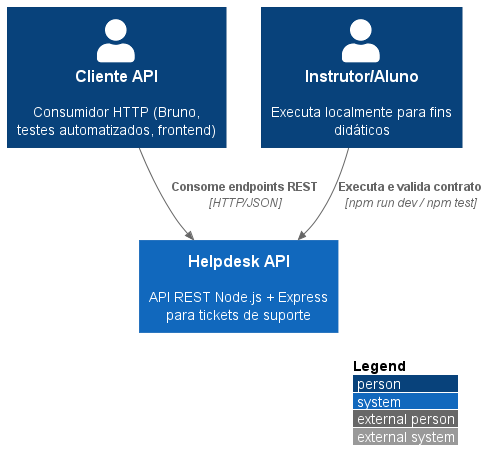
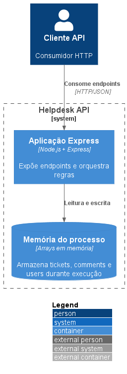
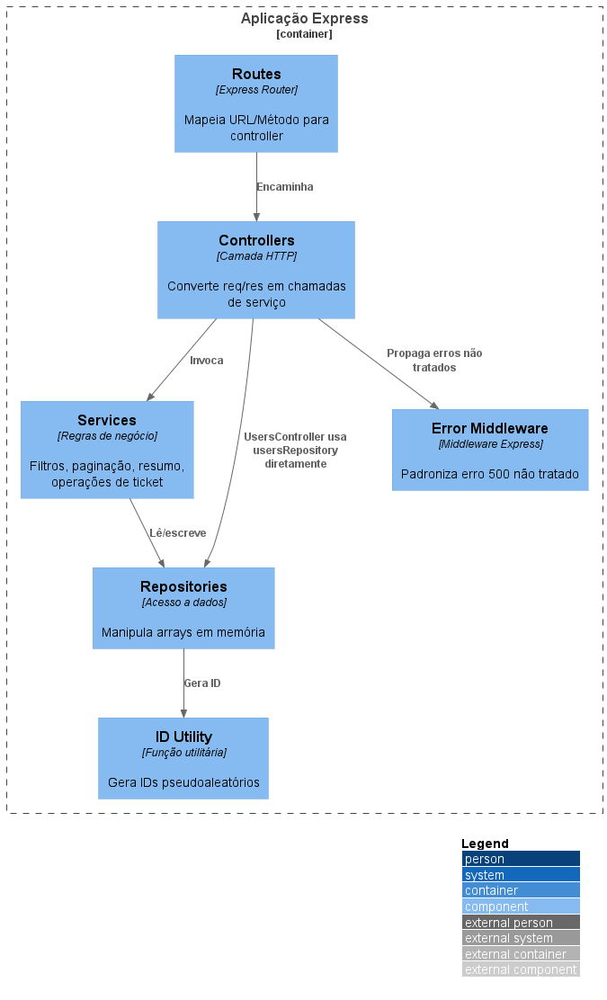
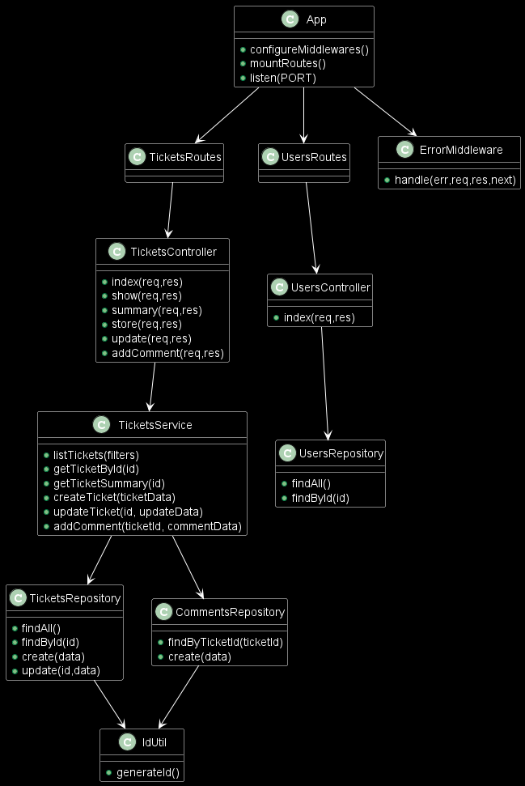
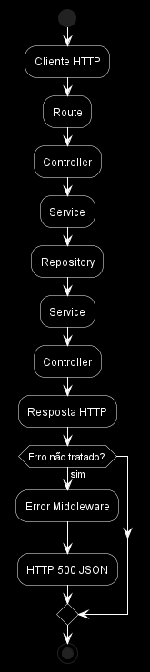

# PlantUML - Modelo C4

Diagramas PlantUML gerados a partir do modelo C4:

1. [01-contexto.puml](./01-contexto.puml)

   

2. [02-conteineres.puml](./02-conteineres.puml)

   

3. [03-componentes.puml](./03-componentes.puml)

   

4. [04-codigo.puml](./04-codigo.puml)

   

5. [05-ciclo-requisicao.puml](./05-ciclo-requisicao.puml)

   

Observação:

- Os níveis C4 usam a biblioteca C4-PlantUML via `!includeurl`.
