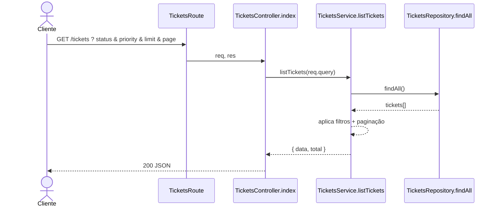

# Fluxo 01 - GET /tickets

## Objetivo

Listar tickets com filtros opcionais (`status`, `priority`) e paginação (`limit`, `page`).

## Sequência

## Regras observadas

- `status` é filtro por igualdade exata.
- `priority` usa igualdade estrita (`===`).
- `limit` e `page` chegam da query e participam de cálculo de slice.
