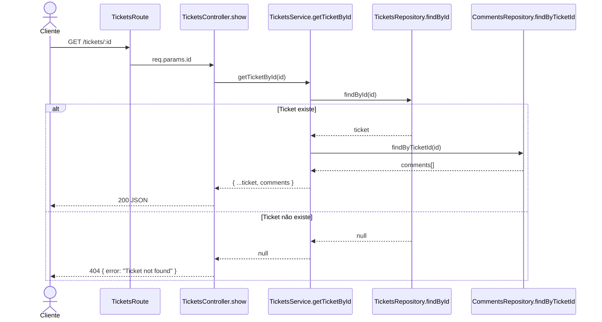

# Fluxo 02 - GET /tickets/:id

## Objetivo
Retornar um ticket por ID incluindo comentários relacionados.

## Sequência

```mermaid
sequenceDiagram
    actor Cliente
    participant R as TicketsRoute
    participant C as TicketsController.show
    participant S as TicketsService.getTicketById
    participant T as TicketsRepository.findById
    participant M as CommentsRepository.findByTicketId

    Cliente->>R: GET /tickets/:id
    R->>C: req.params.id
    C->>S: getTicketById(id)
    S->>T: findById(id)

    alt Ticket existe
        T-->>S: ticket
        S->>M: findByTicketId(id)
        M-->>S: comments[]
        S-->>C: { ...ticket, comments }
        C-->>Cliente: 200 JSON
    else Ticket não existe
        T-->>S: null
        S-->>C: null
        C-->>Cliente: 404 { error: "Ticket not found" }
    end
```
