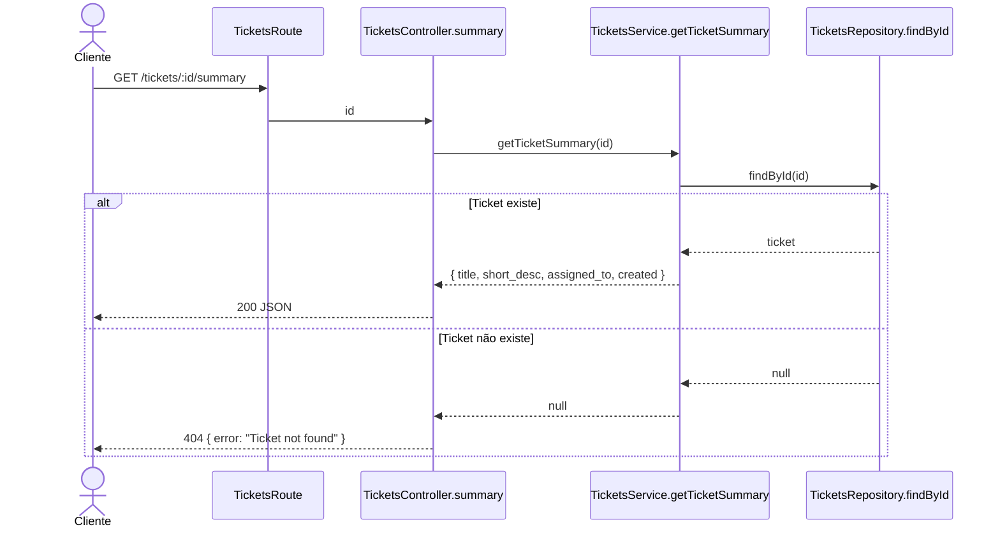

# Fluxo 03 - GET /tickets/:id/summary

## Objetivo
Retornar resumo de um ticket.

## Sequência

```mermaid
sequenceDiagram
    actor Cliente
    participant R as TicketsRoute
    participant C as TicketsController.summary
    participant S as TicketsService.getTicketSummary
    participant T as TicketsRepository.findById

    Cliente->>R: GET /tickets/:id/summary
    R->>C: id
    C->>S: getTicketSummary(id)
    S->>T: findById(id)

    alt Ticket existe
        T-->>S: ticket
        S-->>C: { title, short_desc, assigned_to, created }
        C-->>Cliente: 200 JSON
    else Ticket não existe
        T-->>S: null
        S-->>C: null
        C-->>Cliente: 404 { error: "Ticket not found" }
    end
```

## Observação
No estado atual, `short_desc` referencia `ticket.description`.
