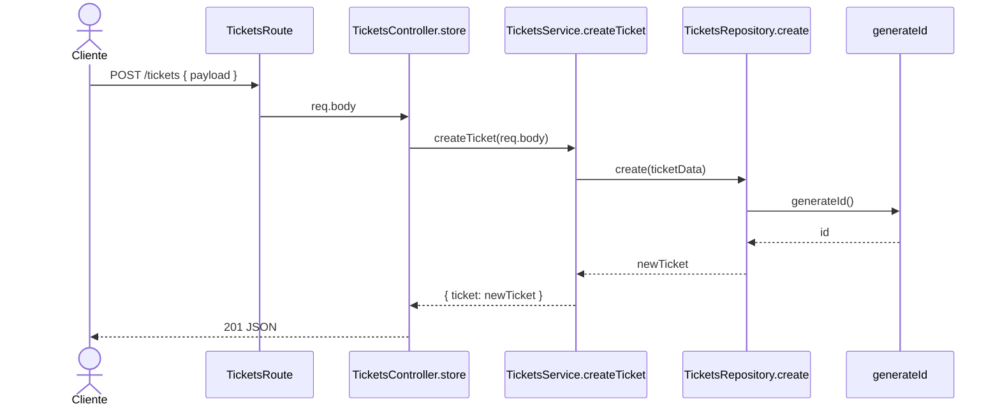

# Fluxo 04 - POST /tickets

## Objetivo

Criar um novo ticket.

## Sequência

```mermaid
sequenceDiagram
    actor Cliente
    participant R as TicketsRoute
    participant C as TicketsController.store
    participant S as TicketsService.createTicket
    participant T as TicketsRepository.create
    participant U as generateId

    Cliente->>R: POST /tickets { payload }
    R->>C: req.body
    C->>S: createTicket(req.body)
    S->>T: create(ticketData)
    T->>U: generateId()
    U-->>T: id
    T-->>S: newTicket
    S-->>C: { ticket: newTicket }
    C-->>Cliente: 201 JSON
```

## Caminho de erro local

Se ocorrer exceção no fluxo de criação, o controller retorna `400` com mensagem.
