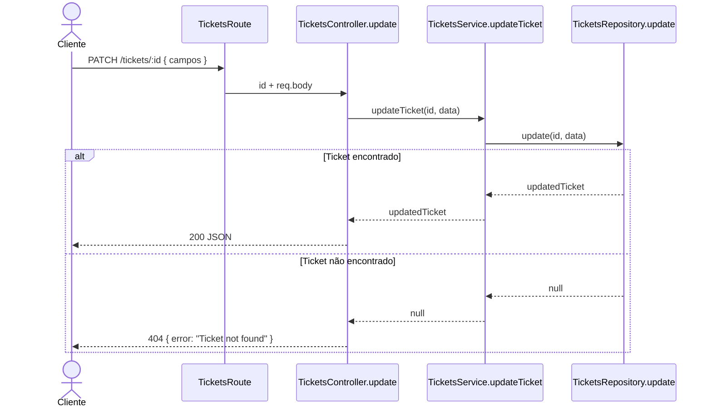

# Fluxo 05 - PATCH /tickets/:id

## Objetivo

Atualizar parcialmente um ticket existente.

## Sequência

```mermaid
sequenceDiagram
    actor Cliente
    participant R as TicketsRoute
    participant C as TicketsController.update
    participant S as TicketsService.updateTicket
    participant T as TicketsRepository.update

    Cliente->>R: PATCH /tickets/:id { campos }
    R->>C: id + req.body
    C->>S: updateTicket(id, data)
    S->>T: update(id, data)

    alt Ticket encontrado
        T-->>S: updatedTicket
        S-->>C: updatedTicket
        C-->>Cliente: 200 JSON
    else Ticket não encontrado
        T-->>S: null
        S-->>C: null
        C-->>Cliente: 404 { error: "Ticket not found" }
    end
```
