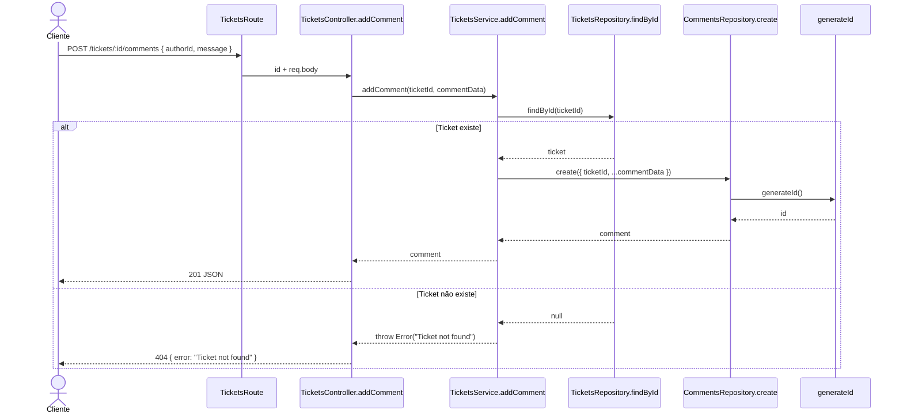

# Fluxo 06 - POST /tickets/:id/comments

## Objetivo
Adicionar comentário em ticket existente.

## Sequência

```mermaid
sequenceDiagram
    actor Cliente
    participant R as TicketsRoute
    participant C as TicketsController.addComment
    participant S as TicketsService.addComment
    participant T as TicketsRepository.findById
    participant M as CommentsRepository.create
    participant U as generateId

    Cliente->>R: POST /tickets/:id/comments { authorId, message }
    R->>C: id + req.body
    C->>S: addComment(ticketId, commentData)
    S->>T: findById(ticketId)

    alt Ticket existe
        T-->>S: ticket
        S->>M: create({ ticketId, ...commentData })
        M->>U: generateId()
        U-->>M: id
        M-->>S: comment
        S-->>C: comment
        C-->>Cliente: 201 JSON
    else Ticket não existe
        T-->>S: null
        S-->>C: throw Error("Ticket not found")
        C-->>Cliente: 404 { error: "Ticket not found" }
    end
```
