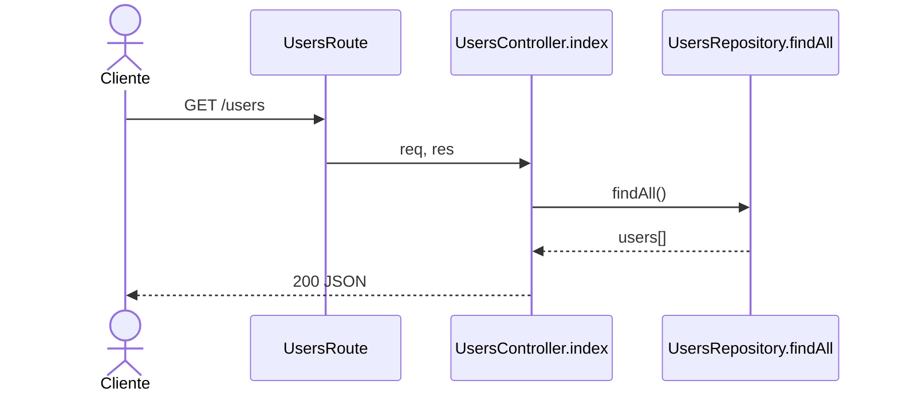

# Fluxo 07 - GET /users

## Objetivo

Listar usuários mockados.

## Sequência

```mermaid
sequenceDiagram
    actor Cliente
    participant R as UsersRoute
    participant C as UsersController.index
    participant U as UsersRepository.findAll

    Cliente->>R: GET /users
    R->>C: req, res
    C->>U: findAll()
    U-->>C: users[]
    C-->>Cliente: 200 JSON
```
