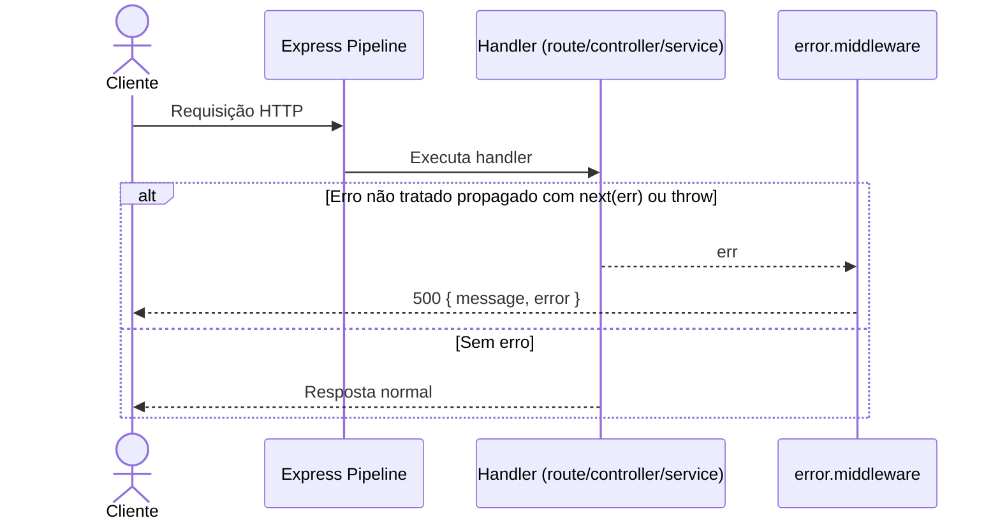

# Fluxo 08 - Middleware global de erro

## Objetivo

Padronizar resposta de erro não tratado em runtime.

## Sequência

## Resposta padrão atual

- `status`: `500`
- body:
  - `message`: `Internal Server Error`
  - `error`: `err.message`
