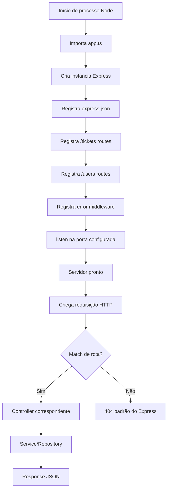
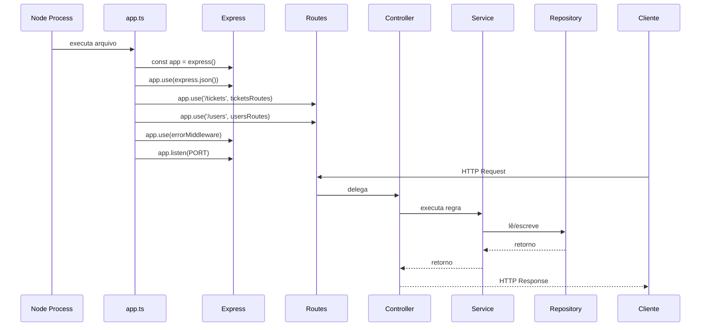

# Fluxo 09 - Inicialização e ciclo de requisição

## Objetivo
Mostrar boot da aplicação e encadeamento de middlewares/rotas.

## Diagrama de fluxo

```mermaid
flowchart TD
    A[Início do processo Node] --> B[Importa app.ts]
    B --> C[Cria instância Express]
    C --> D[Registra express.json]
    D --> E[Registra /tickets routes]
    E --> F[Registra /users routes]
    F --> G[Registra error middleware]
    G --> H[listen na porta configurada]
    H --> I[Servidor pronto]
    I --> J[Chega requisição HTTP]
    J --> K{Match de rota?}
    K -- Sim --> L[Controller correspondente]
    L --> M[Service/Repository]
    M --> N[Response JSON]
    K -- Não --> O[404 padrão do Express]
```

## Sequência resumida

```mermaid
sequenceDiagram
    participant Node as Node Process
    participant App as app.ts
    participant X as Express
    participant R as Routes
    participant C as Controller
    participant S as Service
    participant Repo as Repository
    participant Cli as Cliente

    Node->>App: executa arquivo
    App->>X: const app = express()
    App->>X: app.use(express.json())
    App->>R: app.use('/tickets', ticketsRoutes)
    App->>R: app.use('/users', usersRoutes)
    App->>X: app.use(errorMiddleware)
    App->>X: app.listen(PORT)

    Cli->>R: HTTP Request
    R->>C: delega
    C->>S: executa regra
    S->>Repo: lê/escreve
    Repo-->>S: retorno
    S-->>C: retorno
    C-->>Cli: HTTP Response
```
